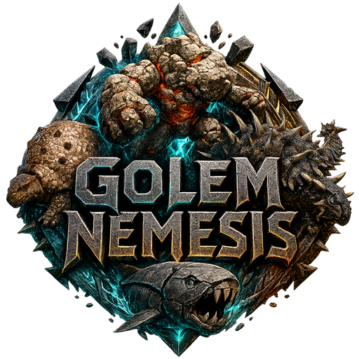

# Golem Nemesis

**Golem Nemesis** makes a small set of anti-golem creatures deal more meaningful damage to Rock Golems and any creature that inherits from them.

## Overview

This mod is aimed at Rock Golems and compatible child classes such as Chalk Golems and Ice Golems.

By default, the mod changes the following interactions:

- Doedicurus deals 100% damage.
- Ankylosaurus deals 100% damage.
- Dunkleosteus deals 100% damage.

Wildcard's default anti-golem damage for these creatures is effectively 10% of their normal damage against Rock Golems. This mod restores them to 100% damage by default while still allowing server owners to tune the value through `GameUserSettings.ini`.

## Affected creatures

- Rock Golem
- Chalk Golem
- Ice Golem
- Other child classes inheriting from Rock Golems

## Affected attackers

- Doedicurus
- Ankylosaurus
- Dunkleosteus

## Configuration

See [Configuration](./configuration.md).

## Changelog

Release changelogs are available on the mod's CurseForge page.

## Community

Get updates, share suggestions, and report bugs.
