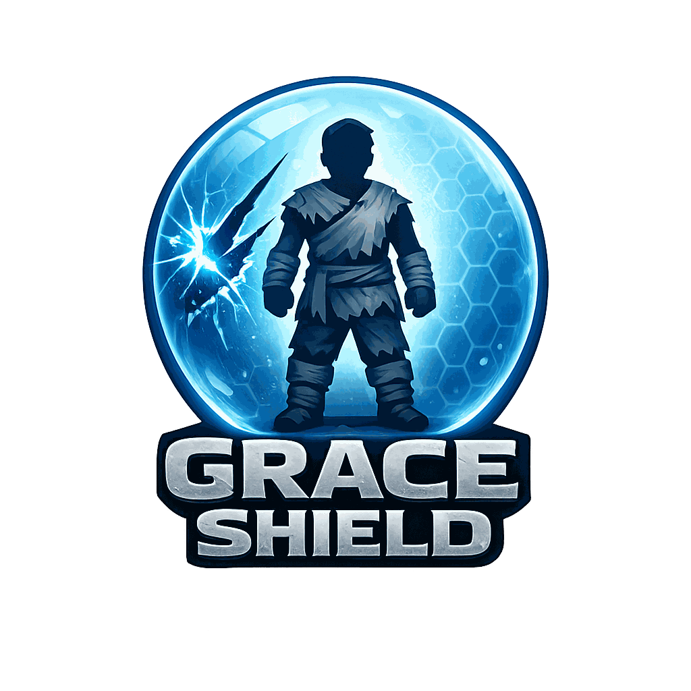

# Grace Shield

**Grace Shield** adds temporary survivor protection after teleporting or respawning.

## Overview

This mod focuses on the short danger window after teleporting, respawning, transferring, or similar movement events.

When Grace Shield detects a qualifying survivor teleport or respawn, it applies a temporary protection buff for the configured duration.

The mod is especially useful for Genesis-style teleport gameplay, where survivors can finish a loading transition in danger before they regain control. Instead of requiring public teleport boxes or protected structures around destination points, Grace Shield provides a configurable server-side grace window.

## Features

- Temporary protection after detected survivor teleport movement.
- Temporary protection after survivor respawn.
- Configurable incoming damage protection while the shield is active.
- Optional outgoing damage prevention while protected.
- Optional wild creature targeting prevention during the grace window.
- Optional cancellation when the protected survivor attacks or moves.

## Behavior / Scope

- Designed as temporary spawn/teleport protection.
- Does not provide permanent invulnerability.
- Teleport detection is movement-based.
- Context changes such as mounting, dismounting, respawn, and attachment changes are treated conservatively.
- Movement caused by supported moving platforms or vehicles is ignored.
- Incoming damage prevention is enabled by default.
- Outgoing damage prevention is enabled by default to avoid offensive use of the grace window.
- Some combat or skill-based teleports are intentionally excluded.

## Known Exclusions

Grace Shield is intended for survivor teleport and respawn safety, not combat teleport immunity.

It does not apply to some combat or skill-based teleports such as Enforcer teleports, Malwyn teleports, Tek Spear teleport behavior, or Lost Colony skills like Strategical Retreat.

It also does not apply while players are being moved by supported moving platforms or vehicles such as rafts, zeppelins, and Tides of Fortune boats, or when using excluded system teleports such as Tek Teleporters, BurrowBack teleports, and Lost Colony base or bunker teleport paths.

If you find another teleport-like ability that should be reviewed, please report it so it can be checked and added to this list if needed.

## Configuration

See [Configuration](./configuration.md).

## Changelog

Release changelogs are available on the mod's CurseForge page.

## Community

Get updates, share suggestions, and report bugs.
